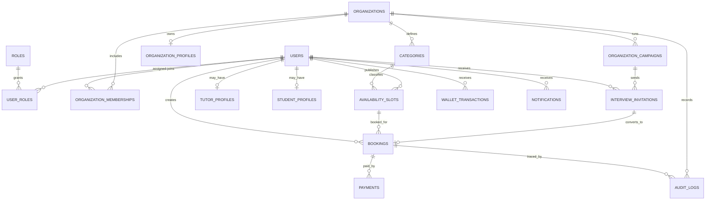

# ER Diagram

## 1. Text Description

The data model centers on users, roles, and organization workspaces. The platform uses a shared marketplace for students and tutors, while organizations run hiring and interview programs. A user may belong to one or more organization workspaces through memberships or invitations. Tutors own availability slots. Students create bookings against slots. Bookings generate payments, notifications, wallet movements, and audit events.

## 2. Mermaid Diagram

## 3. Key Relationship Rules

- A booking belongs to exactly one slot
- A payment belongs to exactly one booking
- An organization membership grants a user access to an organization workspace
- An interview invitation may convert into one booking when accepted
- Wallet transactions must reference a source event
- Audit logs must reference the actor and the affected organization
