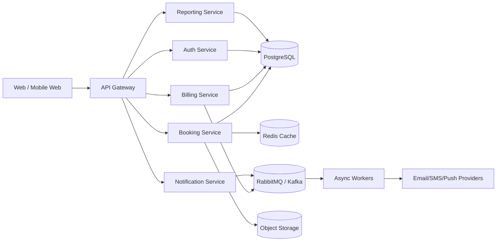

# System Architecture

## 1. Architecture Summary

The platform should start as a modular monolith with clear bounded contexts and evolve toward microservices where scale or team boundaries justify the split. The system must remain API-first, cloud-native, and organized around shared platform services.

## 2. High-Level Layers

| Layer | Responsibility |
| --- | --- |
| Presentation | Web UI, admin console, mobile-responsive frontend |
| API Gateway | Routing, rate limiting, auth enforcement, session routing |
| Application Services | Booking, billing, notifications, wallet, reporting |
| Domain Layer | Business rules, policies, entitlement checks |
| Data Layer | PostgreSQL, Redis, object storage, search indexes |
| Async Layer | Queue workers for reminders, webhooks, payouts |

## 3. Reference Architecture

## 4. Evolution Path

1. Modular monolith for MVP speed and consistency
2. Service extraction for notifications, payments, and reporting
3. Dedicated AI evaluation service as compute demand grows
4. Optional domain-based microservices when team size and traffic justify the split

## 5. Key Design Decisions

- PostgreSQL is the source of truth for transactional data
- Redis is used for caching, rate limiting, and ephemeral state
- RabbitMQ or Kafka is used for asynchronous workflows and integrations
- Object storage holds media, attachments, and exports
